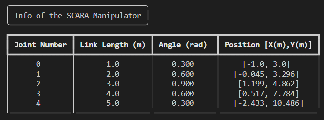
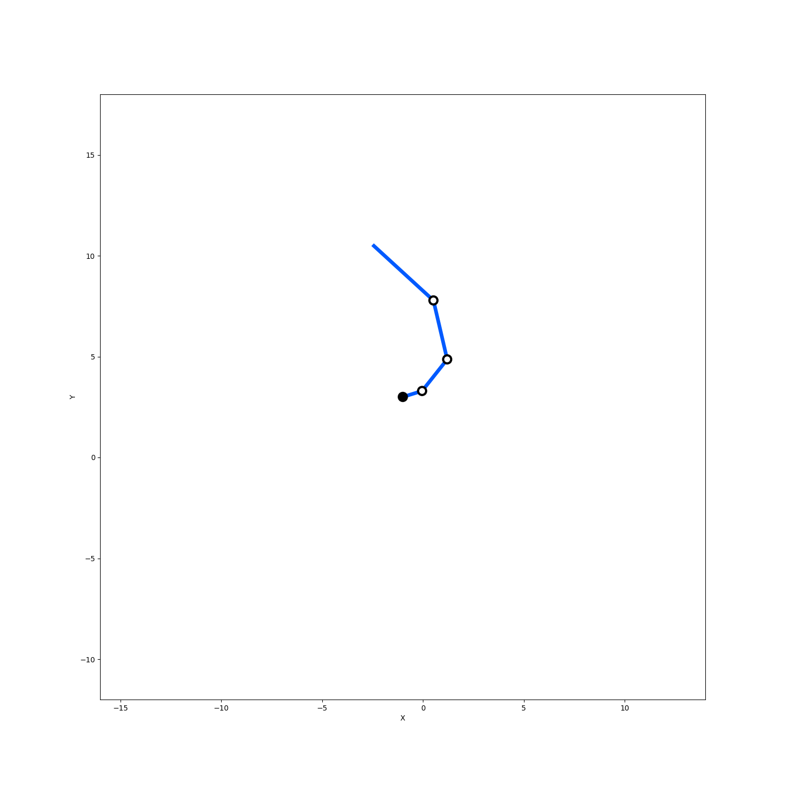

[](https://pepy.tech/project/maniviz)
[](https://pepy.tech/project/maniviz)
[](https://pepy.tech/project/maniviz)

# Maniviz
Simple visualizer of a manipulator.

# Environmental setup
1. `cd /path/to/workingdir`
1. `git clone https://github.com/MizuhoAOKI/maniviz.git`

# Install maniviz from pip
You can also install maniviz easily with pip.

`pip install maniviz`

# Run an Example Script
```
$ cd examples
$ python scara_plot.py
```



